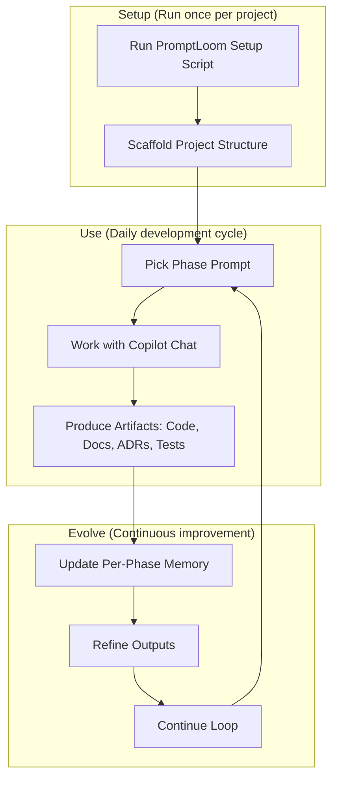

# PromptLoom

**Turn GitHub Copilot Chat into a full project teammate — scaffold your SDLC, guide your AI with phase-specific prompts, and capture decisions in structured memory** [See it in action →](./example)

Built for GitHub Copilot Chat. Interested in Cursor, Claude, or other agents? Open an issue to help prioritize first-class support.

⸻

## Why PromptLoom?
- **Clarity**: Each SDLC phase ships with a ready-to-run agent prompt.
- **Consistency**: Standard structure for prompts, ADRs, tags, and governance.
- **Low-drift memory**: Per-phase, source-linked memory reduces hallucinations.
- **Flexible stacks**: Language-agnostic; you bind capabilities (not tools).
- **Copilot-native**: Prompts and docs are tuned for GitHub Copilot Chat.

⸻

## How It Works (at a glance)



**Setup**: Generate scaffolding once—get 16 prompts, configs, and memory structure
**Use**: Pick any phase (requirements, architecture, testing, etc.) and work with Copilot to produce deliverables
**Evolve**: Capture decisions in structured memory, refine your approach, and build on what worked

⸻

## Example Workflow

Here's how a typical development phase works—every phase prompt follows this pattern, whether it's requirements, architecture, testing, or deployment:

1. **Run phase prompt**: `/03-architecture` in Copilot Chat
2. **AI generates deliverables**: Architecture diagrams, ADRs, component specs
3. **Update memory**: Append structured entry to `docs/memory/03-architecture.md`

Example memory entry structure:
```yaml
---
phase: 03-architecture
tags: [Architecture, Design, TechStack]
sources: [docs/adr/20250809-system-architecture.md]
confidence: high
status: active
---

# Summary
Selected microservices architecture with React frontend and Node.js APIs.

# Key Decisions
- Decision: Microservices over monolith for team scaling
- Rationale: Multiple teams can develop independently
- Owner: Architecture Team
- Date: 2025-08-09

# Evidence
- Source: docs/adr/20250809-system-architecture.md
- PR/Commit: #123 - Initial architecture implementation

# Open Questions
- [ ] How will we handle database migrations in microservices?
- [ ] Should we implement circuit breakers for service communication?

# Links
- Related ADR: docs/adr/20250809-system-architecture.md
- Related Doc: docs/architecture/overview.md
```

See the full context in [example/docs/memory](./example/docs/memory).

⸻

## Quick Start

### 1) Run the setup script (no download required)

```bash
bash <(curl -sSL https://raw.githubusercontent.com/Code-and-Sorts/PromptLoom/main/generate.sh)
```

You'll be prompted for project name, team, tech stack, specializations, and tags.

**Advanced (optional) flags:**
- `--cap-unit|--cap-e2e|--cap-contract|--cap-perf|--cap-docs|--cap-lint ""` to bind capabilities
- `--suggest` to generate `capability_suggestions.yml` (advisory only)
- `-y` to accept defaults, `--force` to overwrite

**Prerequisites:** Bash shell (macOS/Linux/WSL), and GitHub Copilot Chat in VS Code for the agent workflow.

### 2) Review what was generated
- `.github/copilot-instructions.md` — standards, workflow, and capability bindings
- `.github/prompts/` — 16 phase prompts for Copilot Chat (requirements → customize)
- `.github/config/`
  - `team-config.yml`, `phase-config.yml`, `tags.yml`
  - `capabilities.yml` (bind commands you want agents to use; tools optional)
  - `capability_suggestions.yml` (only if `--suggest` used)
- `docs/adr/` — Architecture Decision Records
- `docs/memory/` — structured memory (per-phase files) + `index.md`
- `docs/memory-archive/` — archived/pruned entries
- `docs/framework/` — usage guide and workflow diagrams

### 3) Start a development phase with Copilot Chat
- Open Copilot Chat in VS Code
- Run a phase prompt, e.g. `/01-requirements`
- Produce the artifacts listed in the prompt (docs, tests, code, ADRs)
- Update memory: append a new entry to the relevant file in `docs/memory/` and add a one-liner to `docs/memory/index.md`

⸻

## What You Get (the 60-second tour)
- **16 prompts** covering the SDLC: Requirements, User Stories, Architecture, Docs, Implementation, Testing, Deployment, Release Notes, Security, Memory ops, Error Recovery, Integration Tests, Customization
- **Capabilities-first config**: bind commands for unit/e2e/contract/perf/docs/lint in `capabilities.yml`—tools are suggestions, not mandates
- **Structured memory**: per-phase files with frontmatter (phase, tags, sources, confidence, status) and sections (Summary, Decisions, Evidence, Questions, Links)
- **Diagrams & docs**: Mermaid workflow, usage guide, and ADR scaffolding

⸻

## Where Does It Work?

**Tech Stacks**: PromptLoom is stack-agnostic—originally tuned for TypeScript/React/Node.js, but works with any language or framework (Python, Go, Java, .NET, Rust, etc.)

**Team Sizes**: Works for solo developers, startups, and enterprise teams alike—the structured approach scales from individual projects to multi-team organizations

**Project Types**: Suitable for web apps, APIs, mobile backends, CLI tools, libraries, and full-stack applications

**AI Assistants**: Optimized for GitHub Copilot Chat today—if you want first-class support for other AI coding assistants (Cursor, Claude, etc.), please open an issue as community interest drives the roadmap

⸻

## Documentation
- **Usage Guide**: `docs/framework/usage-guide.md` (phase-by-phase workflow)
- **Workflow Diagram**: `docs/framework/workflow-diagrams.md`
- **Memory**: See `docs/memory/index.md` and the per-phase files under `docs/memory/`
- **ADRs**: Use `docs/adr/` to record architectural decisions

⸻

## Contributing

Issues and PRs are welcome—especially for new prompts, diagrams, or agent integrations.

**Share with the community:**
- Your own prompt templates, memory formats, or capability bindings
- Generated scaffolds from real projects as "recipes" (see our [example](./example) for the format!)
- Success stories and lessons learned from using PromptLoom

Submit a PR or open an issue to add them to our shared library—we especially love seeing how different teams adapt the framework.

If you'd like support for Cursor/Claude/other agents, open a feature request.

## License

MIT. See `LICENSE`.
