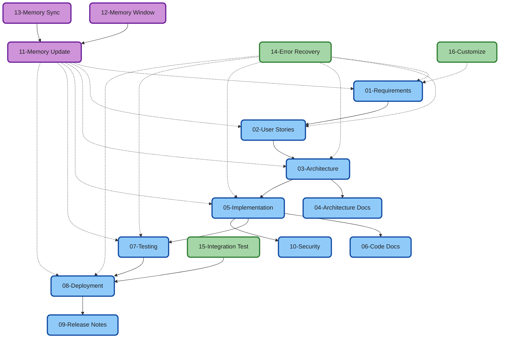
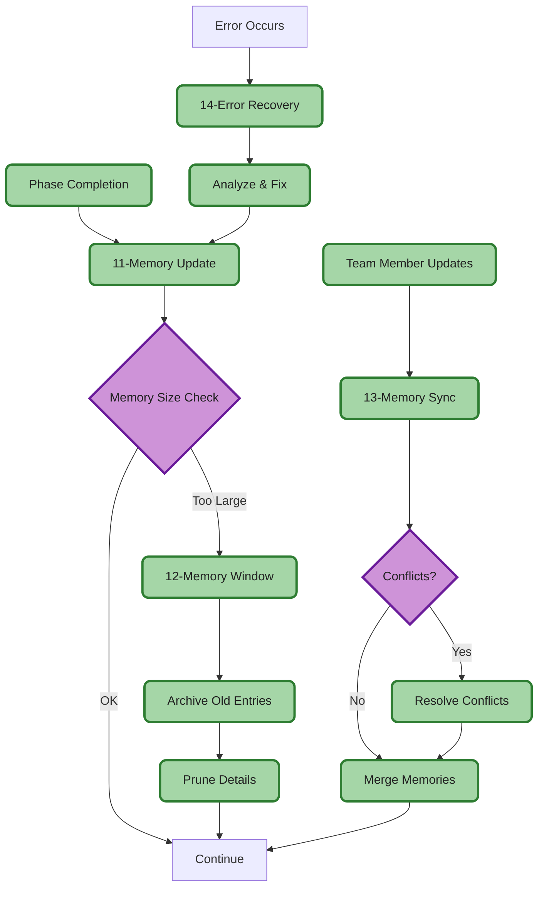

# Project Workflow Diagrams

## Phase Flow Diagram

```mermaid
graph TD
    A[01-Requirements] --> B[02-User Stories]
    B --> C[03-Architecture]
    C --> D[04-Architecture Docs]
    C --> E[05-Implementation]
    E --> F[06-Code Docs]
    E --> G[07-Testing]
    G --> H[08-Deployment]
    H --> I[09-Release Notes]
    E --> J[10-Security]

    %% Memory Management
    K[11-Memory Update] -.-> A
    K -.-> B
    K -.-> C
    K -.-> E
    K -.-> G
    K -.-> H

    L[12-Memory Window] --> K
    M[13-Memory Sync] --> K

    %% Support Processes
    N[14-Error Recovery] -.-> A
    N -.-> B
    N -.-> C
    N -.-> E
    N -.-> G
    N -.-> H

    O[15-Integration Test] --> H
    P[16-Customize] -.-> A

    %% Styling
    classDef phase fill:#90caf9,stroke:#0d47a1,stroke-width:3px,color:#212121,rx:8px,ry:8px,shadow:2px 2px 8px #bdbdbd;
    classDef memory fill:#ce93d8,stroke:#6a1b9a,stroke-width:3px,color:#212121,rx:8px,ry:8px,shadow:2px 2px 8px #bdbdbd;
    classDef support fill:#a5d6a7,stroke:#2e7d32,stroke-width:3px,color:#212121,rx:8px,ry:8px,shadow:2px 2px 8px #bdbdbd;

    class A,B,C,D,E,F,G,H,I,J phase
    class K,L,M memory
    class N,O,P support
```

## Memory Management Flow

```mermaid
graph TD
    A[Phase Completion] --> B[11-Memory Update]
    B --> C{Memory Size Check}
    C -->|Too Large| D[12-Memory Window]
    C -->|OK| E[Continue]
    D --> F[Archive Old Entries]
    F --> G[Prune Details]
    G --> E

    H[Team Member Updates] --> I[13-Memory Sync]
    I --> J{Conflicts?}
    J -->|Yes| K[Resolve Conflicts]
    J -->|No| L[Merge Memories]
    K --> L
    L --> E

    M[Error Occurs] --> N[14-Error Recovery]
    N --> O[Analyze & Fix]
    O --> B

    classDef memory fill:#90caf9,stroke:#0d47a1,stroke-width:3px,color:#212121,rx:8px,ry:8px,shadow:2px 2px 8px #bdbdbd;
    classDef decision fill:#ce93d8,stroke:#6a1b9a,stroke-width:3px,color:#212121,rx:8px,ry:8px,shadow:2px 2px 8px #bdbdbd;
    classDef action fill:#a5d6a7,stroke:#2e7d32,stroke-width:3px,color:#212121,rx:8px,ry:8px,shadow:2px 2px 8px #bdbdbd;

    class A,B,D,F,G,H,I,K,L,N,O action
    class C,J decision
```
